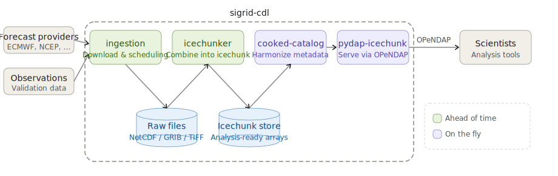

# The Sigrid Climate Data Library suite

Sigrid is a collection of software components for building and operating a
library of analysis-ready climate data. The current focus is on seasonal and
seasonal-to-subseasonal climate forecasts, and on observational data that are
used to validate and calibrate such forecasts.

There has not yet been a stable release of Sigrid. It is changing rapidly, and
there should be no expectation of backwards compatibility for now.

This project is named Sigrid because it is a **s**uccessor to
**I**n**grid**, the [software](https://bitbucket.org/iridl/ingrid/) on
which the IRI Data Library (199x-2026) was built. Sigrid follows some of the
architectural principles developed in Ingrid, but is a new implementation.

## The components of a Sigrid-based Climate Data Library
A "data librarian" who wishes to host a dataset uses the Sigrid suite to
create the following:
- **Download script**: a scheduled, automated process that periodically
  downloads data files from an upstream data producer.
- **Raw data catalog**: structural information that allows a collection of
  downloaded data files to be treated as a single entity. For example, a
  seasonal forecasting system may generate one NetCDF file for each of 20
  ensemble members, for each initialization date, with each file having the
  three internal dimensions (target period, latitude, longitude); the raw
  catalog allows a large set of forecasts to be viewed as a single array with
  dimensions (initialization date, member number, target period, latitude,
  longitude).
- **Cooked data catalog**: instructions for harmonizing the metadata and
  structure of multidimensional arrays from different providers. Harmonization
  may include things like standardizing variable names and attributes, and
  converting to common physical units.

Once these artifacts have been created, the Sigrid server software can provide
access to the dataset in its "cooked" (harmonized) form via a web interface for
browsing, and the [OPeNDAP protocol](https://en.wikipedia.org/wiki/OPeNDAP) for
downloading data.

The Sigrid suite has four components:
- `download` (coming soon): a library of utilities for use in writing reliable
  download scripts.
- `preprocess`: a program that defines the raw catalog format, and does
  ahead-of-time processing to support efficient access to raw datasets.
- `harmonize`: a library of array harmonization utilities for use in cooked data
  catalogs.
- `serve`: an application that provides the web and OPeNDAP interfaces.

This repository is organized in two subdirectories: `ingestion` contains the
`download` and `preprocess` packages, which are used for ahead-of-time data
preparation, and `server` contains the `harmonize` and `serve` packages, which
are the components involved in on-the-fly processing of user requests.

## Initial setup for development/testing

- Check out this repo and your site's catalog repo as sibling directories. In
  the case of forecast.ccsr.columbia.edu, the first Sigrid site, the catalog
  repo is called ccsr-config.
- In this repo, copy `dot-env-example` to a new file called `.env`

        cp dot-env-example .env

- Edit the paths in `.env` to match your local configuration. Relative paths and
  environment variables are not supported, so use absolute paths. Change
  `PYDAP_PORT` to a unique number so you don't collide with other developers on
  the same server.

